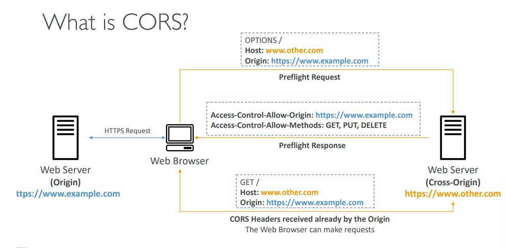

### 🔁 Step-by-Step:

#### 1\. **You go to `example.com`**

-   This serves your **React app** (HTML, JS, etc.) from the frontend server.

-   Browser downloads and runs your React code.

* * * * *

#### 2\. **React app tries to call `other.com/api/something`**

-   `example.com` (frontend) is calling `other.com` (backend).

-   Different domains = **CORS** (Cross-Origin Resource Sharing) kicks in.

* * * * *

#### 3\. **Browser says "hold up!" and sends a preflight request**

If the request is **not simple** (e.g. uses `POST`, custom headers, etc.), the browser sends:

http

CopyEdit

`OPTIONS /api/something HTTP/1.1
Origin: https://example.com
Access-Control-Request-Method: POST
Access-Control-Request-Headers: Content-Type`

-   This is the **preflight request**:\
    "Hey `other.com`, is it cool if `example.com` makes this request?"

* * * * *

#### 4\. **`other.com` must reply with CORS headers** like:

http

CopyEdit

`Access-Control-Allow-Origin: https://example.com
Access-Control-Allow-Methods: POST, GET
Access-Control-Allow-Headers: Content-Type`

-   If it doesn't? ❌ The browser blocks the real request. You get a CORS error.

-   If it does? ✅ Browser goes ahead.

* * * * *

#### 5\. **Browser sends the real request**

Now the actual `POST` or `GET` is sent:

http

CopyEdit

`POST /api/something
Origin: https://example.com
Content-Type: application/json
...`

* * * * *

#### 6\. **`other.com` responds**

If all goes well, it sends back data. React gets it, updates the UI. Everyone's happy.

* * * * *

### 🔥 TL;DR:

-   Your React app (on `example.com`) talks to a backend on `other.com`.

-   Browser sends a **preflight OPTIONS** request if needed.

-   Backend must say "yep, that's cool" with **CORS headers**.

-   Then the real request is sent.

-   No proper CORS headers? 💥 CORS error.

